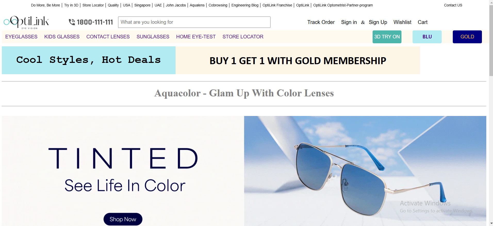
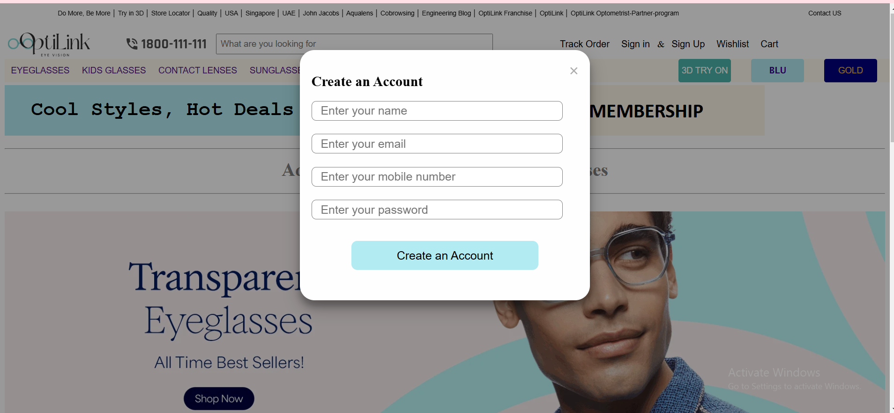
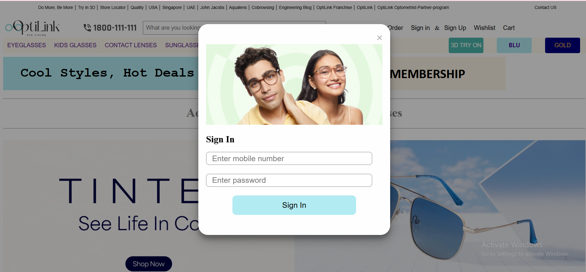
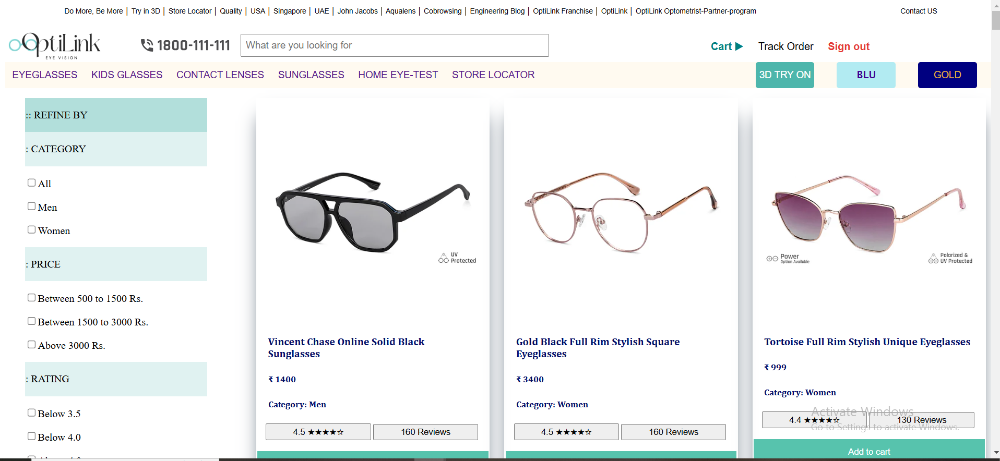
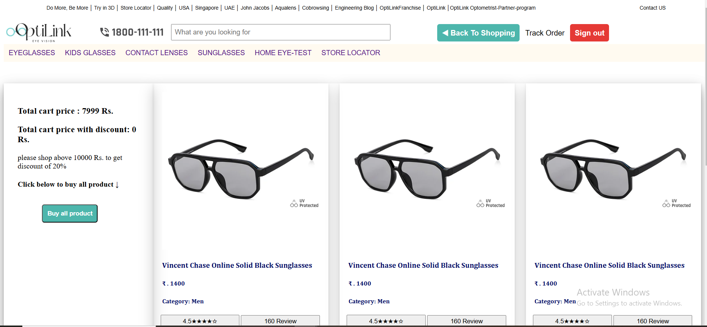
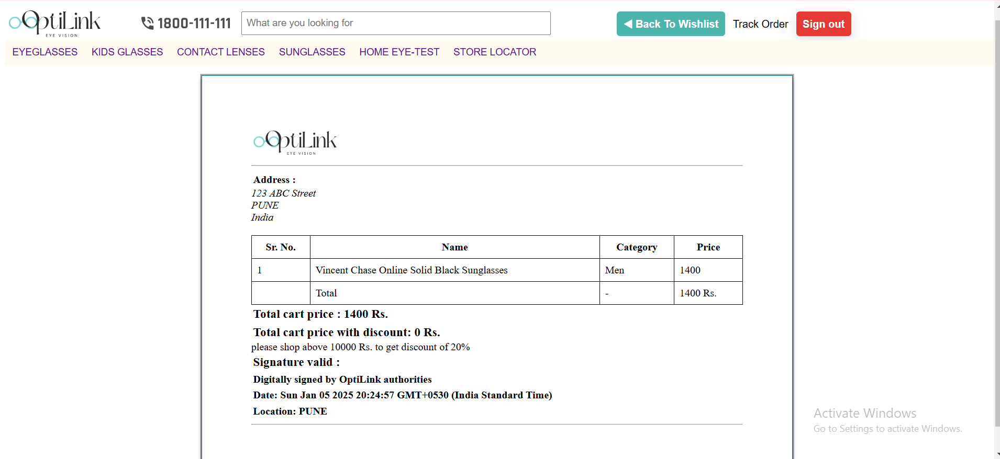

# OptiLink-EYE-VISION-App

# OptiLink(Lenskart Clone) 
This website is a clone of Lenskart.com.
Lenskart is an Indian eyewear online portal. It deals in sunglasses, eyeglasses, and contact lenses. 

## Homepage
- This page has a navbar and some carousels of glasses, fascination slideshows, and an about section.
  
  
 
## Signup
- The navbar has an anchor tag with the content 'signup'. Once you click on that a model pops up on the homepage, which has a form that takes the name, email, phone, and password to sign up.
  
  

## Signin
- The navbar has an anchor tag with the content 'signin'. Once you click on that a model pops up on the homepage, which has a form that takes email and password to sign in.

  

## Product page
- This page has cards of all the products, each with an 'add to cart' button which will add the products to carts. This page has various filters like filter by gender, filter by price range, and filter by rating.
  
 

## Cart page
- This page has all the items from carts. A user can remove any item from the cart by clicking on the 'delete' button. There is a div that has the total cart price. After clicking on 'buy all products' it will take you to the 'invoice page'.
  
  

## Invoice page
- On the invoice page the user will receive an invoice including the company's details, signatures, a table having the details of each product, and the total bill with the discount(if applicable).
  

## Important Link 
Deployed link: https://eyesfx.netlify.app/

## Tech Stack

  
          
